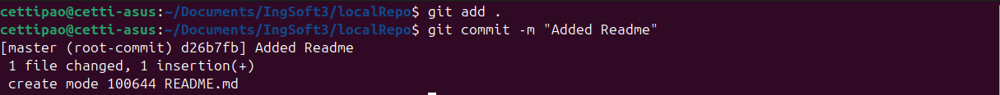
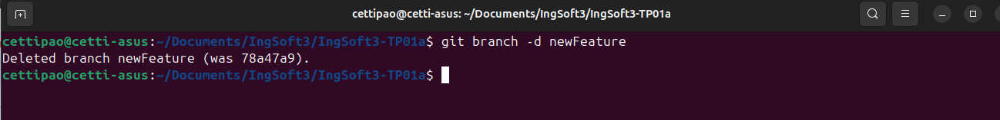
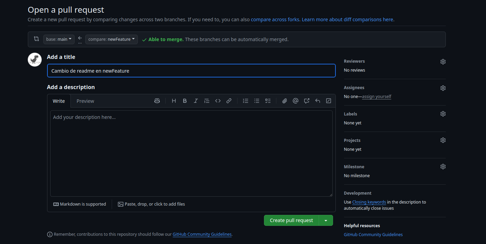

# Trabajo Practico 1
Cetti Paolo (2223989)

### 1. Instalar Git

### 2. Crear un repositorio local y agregar archivos
1. Crear un repositorio local:

2. Agregar un archivo `README.md` con contenido:

3. Hacer un commit con un mensaje descriptivo:

### 3. Configuración del Editor Predeterminado

### 4. Creación de Repos 01 -> Crearlo en GitHub, clonarlo localmente y subir cambios
1. Crear una cuenta en GitHub
2. Crear un nuevo repositorio en GitHub con `README.md` por defecto.

3. Clonar el repositorio remoto:
Copiamos la url del repo

Clonamos

4. Editar el archivo `README.md`:

Verificamos el cambio con git status

5. Crear el archivo `.gitignore`:

6. Hacer commit y push:

### 5. Creación de Repos 02 -> Crearlo localmente y subirlo a GitHub
1. Crear un repositorio local:

2. Agregar archivo `README.md`:

3. Crear repositorio en GitHub.

4. Asociar repo local con remoto:

5. Crear archivo `.gitignore`:

6. Hacer commit y push:

### 6. Ramas
1. Crear una nueva rama:

2. Cambiarse a esa rama:

3. Hacer un cambio en `README.md` y hacer commit:

4. Revisar diferencias entre ramas:

### 7. Merges
1. Hacer un merge FF (fast-forward):

2. Borrar la rama creada:

3. Ver el log de commits:

4. Repetir el ejercicio 6 para hacer un merge con No-FF:

### 8. Resolución de Conflictos
* Instalar alguna herramienta de comparación:
Usaré la que trae Visual Studio Code ya que ya lo tengo configurado asi en el git

* Crear una nueva rama conflictBranch:

* Modificar `README.md` desde `main` y commitear:

* Modificar la misma línea desde `conflictBranch` y commitear:

* Ver diferencias:

* Intentar mergear y resolver conflicto:

### 9. Familiarizarse con el concepto de Pull Request
1. Un Pull Request es una función de GitHub que permite a tu equipo solicitar la revisión y aprobación de sus cambios antes de fusionarlos en la rama principal de desarrollo, denominada “master” o “main”.
2. Crear un branch local y agregar cambios:

3. Crear un pull request en GitHub y completar el proceso de revisión y merge.

### 10. Algunos ejercicios online
1. Entrar a [Learn Git Branching](https://learngitbranching.js.org/).
2. Completar los ejercicios de Introduction Sequence.
