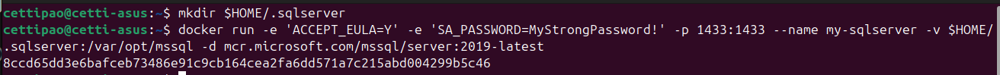

# Trabajo practico N°2

- [Trabajo practico N°2](#trabajo-practico-n2)
  - [Ejercicio 1](#ejercicio-1)
  - [Ejercicio 2](#ejercicio-2)
  - [Ejercicio 3](#ejercicio-3)
  - [Ejercicio 4](#ejercicio-4)
  - [Ejercicio 5](#ejercicio-5)
  - [Ejercicio 6](#ejercicio-6)
  - [Ejercicio 7](#ejercicio-7)
  - [Ejercicio 8](#ejercicio-8)
  - [Ejercicio 9](#ejercicio-9)
  - [Ejercicio 10](#ejercicio-10)
  - [Ejercicio 11](#ejercicio-11)
  - [Ejercicio 12](#ejercicio-12)
  - [Ejercicio 13](#ejercicio-13)
  

## Ejercicio 1

* Diferentes opciones para cada sistema operativo
* https://docs.docker.com/
* Ejecutar el siguiente comando para comprobar versiones de cliente y demonio

Vemos la **version** de docker instalada:


## Ejercicio 2

* Registrase en docker hub: https://hub.docker.com/
* Familiarizarse con el portal

Creamos una **Cuenta** y nos familiarizamos con [docker-hub](https://hub.docker.com/):


## Ejercicio 3

* Ejecutar el siguiente comando, para bajar una imagen de DockerHub

Pulleamos una imagen de busybox.


* Verificar qué versión y tamaño tiene la imagen bajada, obtener una lista de imágenes locales:

Vemos las imagenes instaladas en nuestro equipo localmente.


## Ejercicio 4

* Ejecutar un contenedor utilizando el comando run de docker:


* Explicar porque no se obtuvo ningún resultado

No se obtuvo nada porque el comando no se ejecuto con las **flags**:
* **-d**: detached mdoe
* **-it**: interactive mode

O algun otro modo, por lo que el contenedor (en este caso busybox) se **ejecuta** exitosamente y posteriormente **termina** su ejecución sin emitir ningun tipo de **log** en consola.

* Especificamos algún comando a correr dentro del contendor, ejecutar por ejemplo:


* Ver los contendores ejecutados utilizando el comando ps:


* Vemos que no existe nada en ejecución, correr entonces:


* Mostrar el resultado y explicar que se obtuvo como salida del comando anterior.

Se obtuvo una lista de todos los contenedores, incluso lo que estan apagados o en status "Exited (0)"

## Ejercicio 5

* Ejecutar el siguiente comando: docker run -it busybox sh
* Para cada uno de los siguientes comandos dentro de contenedor, mostrar los resultados:

Creamos el contenedor de manera **interactiva** y ejecutamos los comandos.


* Salimos del contendor con: exit

## Ejercicio 6

* Obtener la lista de contendores


* Para borrar todos los contendores que no estén corriendo, ejecutar cualquiera de los siguientes comandos:


o con prune:


## Ejercicio 7

* Conceptos de DockerFile
1. Leer https://docs.docker.com/engine/reference/builder/ (tiempo estimado 2 horas)
2. Describir las instrucciones

* FROM: Especifica la imagen base desde la cual se construirá el contenedor. Es la primera instrucción en un Dockerfile.
* RUN: Ejecuta comandos en la imagen durante el proceso de construcción. Es útil para instalar paquetes o configurar el entorno.
* ADD: Copia archivos o directorios del host al sistema de archivos del contenedor. También puede descomprimir archivos tar automáticamente.
* COPY: Similar a ADD, copia archivos o directorios del host al contenedor, pero sin descompresión ni funcionalidades adicionales.
* EXPOSE: Informa a Docker que el contenedor escuchará en un puerto específico, pero no lo publica en el host.
* CMD: Especifica el comando por defecto que se ejecutará cuando se inicie un contenedor. Puede ser sobrescrito por argumentos de la línea de comandos.
* ENTRYPOINT: Define el comando que siempre se ejecutará cuando se inicie el contenedor, similar a CMD, pero menos flexible.

* A partir del código https://github.com/ingsoft3ucc/SimpleWebAPI crearemos una imagen.
* Clonar repo

* Crear imagen etiquetándola con un nombre. El punto final le indica a Docker que use el dir actual


* Revisar Dockerfile y explicar cada línea

```
# Utiliza la imagen base de ASP.NET Core 7.0 desde el repositorio de Microsoft.
FROM mcr.microsoft.com/dotnet/aspnet:7.0 AS base

# Establece el directorio de trabajo dentro del contenedor.
WORKDIR /app

# Expone el puerto 80 para tráfico HTTP.
EXPOSE 80

# Expone el puerto 443 para tráfico HTTPS.
EXPOSE 443

# Expone el puerto 5254 (puerto específico de la aplicación).
EXPOSE 5254

# Utiliza la imagen del SDK de .NET Core 7.0 para construir la aplicación.
FROM mcr.microsoft.com/dotnet/sdk:7.0 AS build

# Establece el directorio de trabajo dentro del contenedor.
WORKDIR /src

# Copia el archivo de proyecto (csproj) de la aplicación en el contenedor.
COPY ["SimpleWebAPI/SimpleWebAPI.csproj", "SimpleWebAPI/"]

# Restaura las dependencias de NuGet para el proyecto especificado.
RUN dotnet restore "SimpleWebAPI/SimpleWebAPI.csproj"

# Copia todos los archivos desde el contexto de construcción al contenedor.
COPY . .

# Cambia el directorio de trabajo al del proyecto específico dentro del contenedor.
WORKDIR "/src/SimpleWebAPI"

# Compila el proyecto en modo Release y guarda la salida en el directorio /app/build.
RUN dotnet build "SimpleWebAPI.csproj" -c Release -o /app/build

# Utiliza la imagen de compilación anterior como base para la fase de publicación.
FROM build AS publish

# Publica la aplicación, optimizando para producción y coloca la salida en /app/publish.
RUN dotnet publish "SimpleWebAPI.csproj" -c Release -o /app/publish /p:UseAppHost=false

# Utiliza la imagen base (ASP.NET) y copia los archivos publicados desde la etapa anterior.
FROM base AS final

# Establece el directorio de trabajo como /app dentro del contenedor.
WORKDIR /app

# Copia los archivos publicados desde la etapa 'publish' a la carpeta actual en el contenedor.
COPY --from=publish /app/publish .

# Establece el punto de entrada del contenedor, indicando que debe ejecutarse el archivo .dll de la aplicación.
ENTRYPOINT ["dotnet", "SimpleWebAPI.dll"]

# Comando CMD comentado, podría usarse para sobrescribir el punto de entrada, por ejemplo, para acceder a una shell.
#CMD ["/bin/bash"]

```

* Ver imágenes disponibles


* Ejecutar un contenedor con nuestra imagen


* Subir imagen a nuestra cuenta de dockerhub

Para ello debemos iniciar sesion en dockerhub desde la terminal


Despues le ponemos un tag a nuestra imagen y la subimos con push


## Ejercicio 8

- Ejecutar la siguiente imagen, en este caso utilizamos la bandera -d (detach) para que nos devuelva el control de la consola:


- Ejecutamos un comando ps:


- Vemos que el contendor expone 3 puertos el 80, el 5254 y el 443, pero si intentamos en un navegador acceder a http://localhost/WeatherForecast no sucede nada.

- Procedemos entonces a parar y remover este contenedor:


- Vamos a volver a correrlo otra vez, pero publicando los puertos 80 y 5254


- Accedamos nuevamente a http://localhost/WeatherForecast y a http://localhost/swagger/index.html y expliquemos que sucede.


Lo que sucedio es que dentro del contenedor se estaba ejecutando el servidor pero no se estaba publicando en los puertos de mi maquina local, solo estaba en los puertos del contenedor de docker. 
Por eso la segunda vez que lo levantamos, pusimos para que matchee el puerto 80 del contenedor con el puerto 80 de mi maquina local, asimismo con el 5254

## Ejercicio 9 

- Modificamos dockerfile para que entre en bash sin ejecutar automaticamente la app
```bash
#ENTRYPOINT ["dotnet", "SimpleWebAPI.dll"]
CMD ["/bin/bash"]
```
- Rehacemos la imagen


- Corremos contenedor en modo interactivo exponiendo puerto


- Vemos que no se ejecuta automaticamente


- Ejecutamos app:


-Volvemos a navegar a http://localhost/weatherforecast


Salimos del contenedor

## Ejercicio 10 
Montando volúmenes
Hasta este punto los contenedores ejecutados no tenían contacto con el exterior, ellos corrían en su propio entorno hasta que terminaran su ejecución. Ahora veremos cómo montar un volumen dentro del contenedor para visualizar por ejemplo archivos del sistema huésped:

- Ejecutar el siguiente comando, cambiar myusuario por el usuario que corresponda. En Mac puede utilizarse /Users/miusuario/temp (Yo uso linux, seria /home/USER/temp):
 


- Dentro del contenedor correr


- Verificar que el Archivo se ha creado en el directorio del guest y del host.


## Ejercicio 11

- Levantar una base de datos PostgreSQL


- Ejecutar sentencias utilizando esta instancia


- Conectarse a la base utilizando alguna IDE (Dbeaver - https://dbeaver.io/, eclipse, IntelliJ, etc...). Interactuar con los objectos objectos creados.


- Explicar que se logro con el comando docker run y docker exec ejecutados en este ejercicio.

1. docker run: Inicia un contenedor con PostgreSQL, configurando la base de datos y exponiendo el puerto 5432 para acceso externo.
2. docker exec: Permite acceder al contenedor para ejecutar comandos SQL dentro de la base de datos PostgreSQL.

## Ejercicio 12
Hacer el punto 11 con Microsoft SQL Server
* Armar un contenedor con SQL Server
* Crear BD, Tablas y ejecutar SELECT

1. Crear un contenedor con SQL Server



2. Acceder al contenedor y conectarse a SQL Server


3. Crear base de datos, tablas y ejecutar consultas


## Ejercicio 13
Presentación del trabajo práctico.
Subir un archivo md (puede ser en una carpeta) trabajo-practico-02 con las salidas de los comandos utilizados. Si es necesario incluir también capturas de pantalla.