## Trabajo Práctico 3 - Introducción a Azure Devops

 **¿Qué es Azure DevOps?**

**Azure DevOps** es un conjunto de herramientas de Microsoft diseñado para facilitar la colaboración en el desarrollo de software. Incluye servicios para la planificación de proyectos, la gestión del código fuente, la integración continua y la entrega continua (CI/CD), la gestión de pruebas y la implementación en la nube. Las principales herramientas dentro de Azure DevOps son Azure Repos (control de versiones), Azure Pipelines (CI/CD), Azure Boards (gestión de proyectos), Azure Test Plans (pruebas) y Azure Artifacts (gestión de paquetes).

#### Beneficios de utilizar Azure DevOps:

1. **Integración con el ecosistema de Microsoft**: Azure DevOps se integra fácilmente con herramientas de Microsoft como Visual Studio, GitHub, y Azure, lo que simplifica la implementación en entornos de desarrollo que ya utilizan estas tecnologías.

2. **Versatilidad y flexibilidad**: Admite una amplia gama de lenguajes de programación, plataformas y entornos de despliegue, lo que permite a los equipos trabajar con sus tecnologías preferidas.

3. **Automatización completa del ciclo de vida del desarrollo**: Facilita la implementación de prácticas DevOps como CI/CD, mejorando la eficiencia y reduciendo los errores en el proceso de entrega de software.

4. **Escalabilidad**: Azure DevOps es adecuado tanto para proyectos pequeños como para grandes organizaciones con múltiples equipos de desarrollo.

5. **Integración con herramientas de terceros**: Además de las herramientas de Microsoft, se puede integrar con otras soluciones como Jira, Jenkins, Docker, Kubernetes, entre otros.

6. **Seguridad y control**: Ofrece control granular sobre los permisos de acceso y la gestión de código, además de cumplir con estándares de seguridad y cumplimiento de la industria.

#### Pasos del TP
 - 3.1 Crear una cuenta en Azure DevOps
 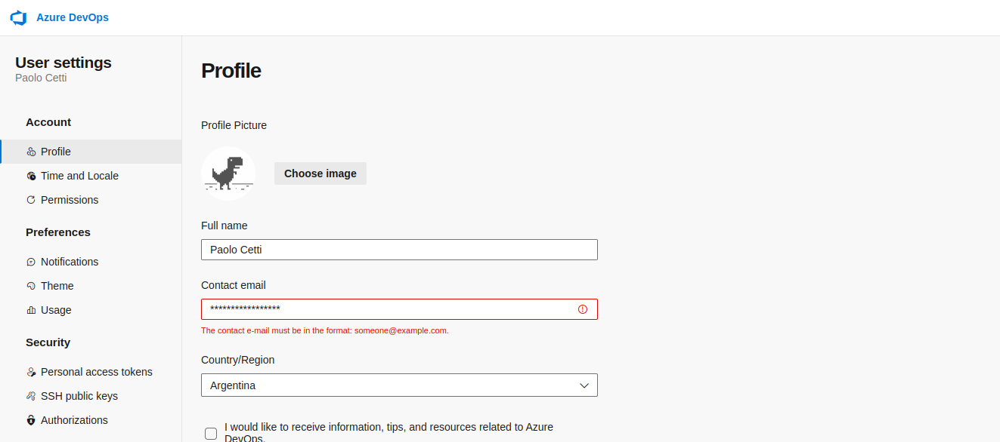
 - 3.2 Crear un repo GIT
 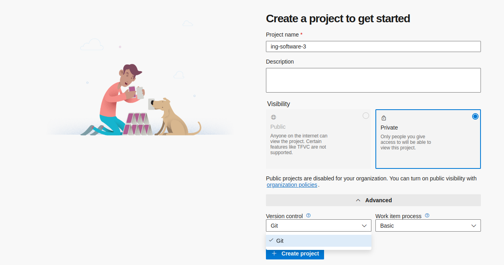
 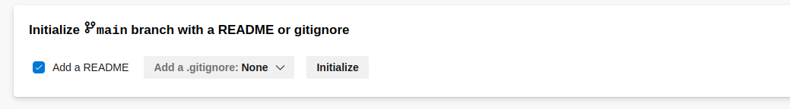
 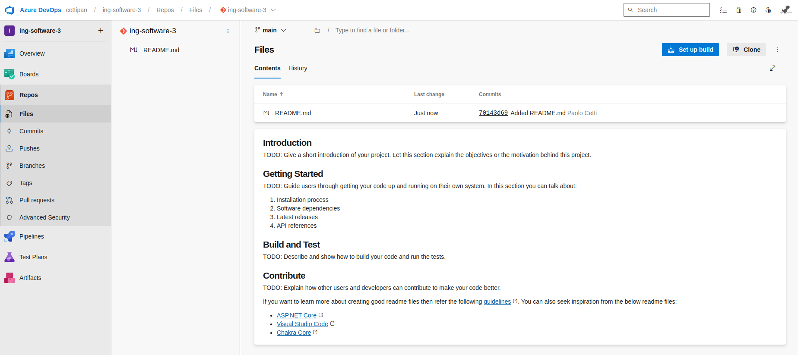
 - 3.3 Crear un repo TFVC
 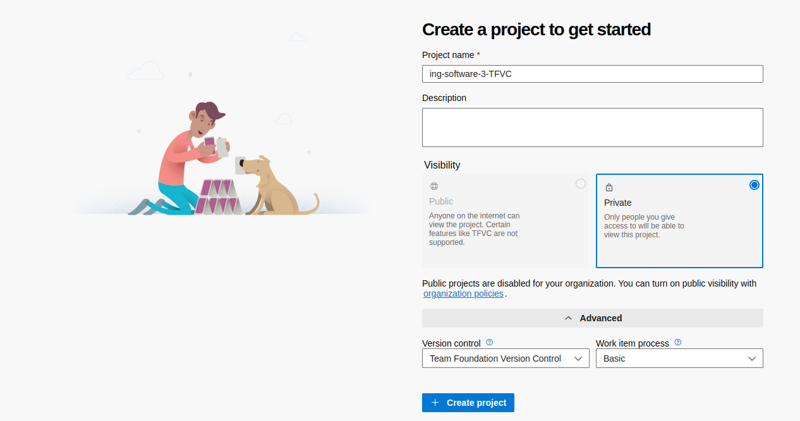
 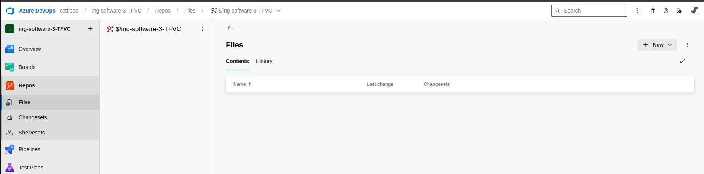
 - 3.4 Importar un repo desde GitHub
 

 Voy a importar mi repo de ([ing-software-3](https://github.com/cettipao/ing-software-3))

 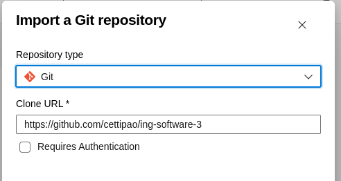
 
 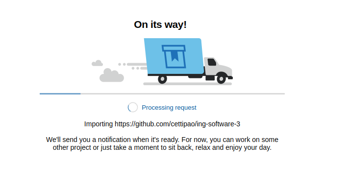
 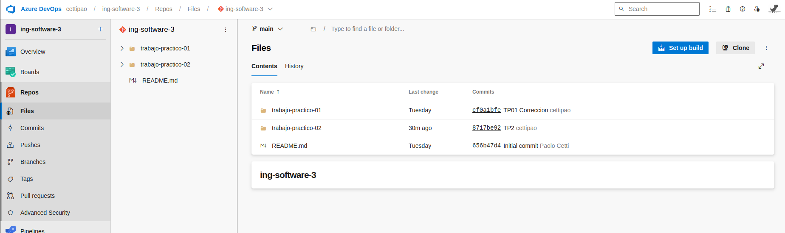
 - 3.5 Clonarlo localmente

 Copiamos el link generado por azure

 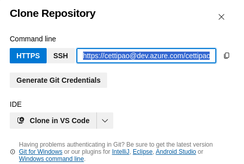

 Clonamos:

 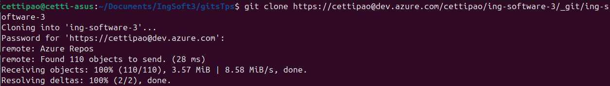

 - 3.6 Realizar un cambio en un archivo, y subirlo al repo de ADO.

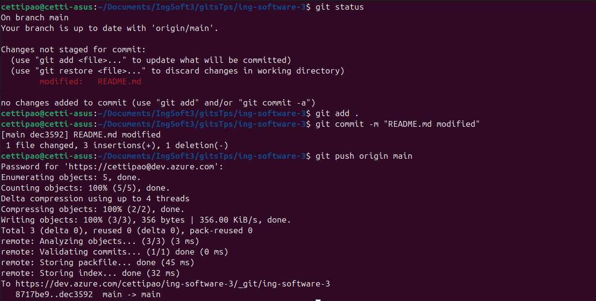

Verificamos el commit en el repo

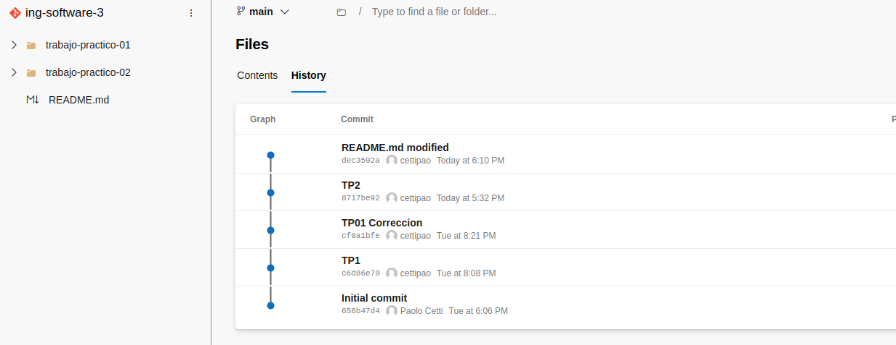

#### 4- Presentación del trabajo práctico.
Subir un al repo con las capturas de pantalla de los pasos realizados