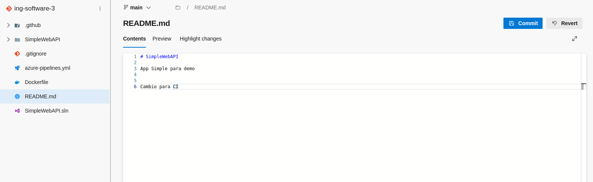
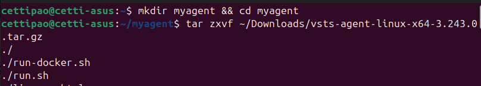

# Trabajo Práctico 4 - Azure Devops Pipelines

Cetti Paolo - 2223989

## Pasos del TP
 - 4.1 Verificar acceso a Pipelines concedido

 - 4.2 Agregar en pipeline YAML una tarea de Publish. 

* **PublishBuildArtifacts@1**: Esta es la tarea estándar en Azure DevOps para publicar artefactos desde el directorio de staging ($(Build.ArtifactStagingDirectory)), donde se guardan los archivos generados durante el proceso de construcción.
* **PathtoPublish**: Especifica el camino a los archivos que se publicarán. En este caso, usamos $(Build.ArtifactStagingDirectory), que es la ubicación predeterminada donde se guardan los artefactos durante la construcción.
* **ArtifactName**: Le damos un nombre al conjunto de artefactos que estamos publicando, en este caso drop.
* **publishLocation**: Especifica dónde se publicarán los artefactos. Container indica que los artefactos se almacenarán en el servicio de artefactos de Azure DevOps.

 - 4.3 Explicar por qué es necesario contar con una tarea de Publish en un pipeline que corre en un agente de Microsoft en la nube.

Esta tarea es crucial porque permite que los artefactos generados en el agente se almacenen en un lugar accesible, como el almacenamiento de artefactos de Azure DevOps. Sin esta tarea, los artefactos no serían accesibles después de que el pipeline termine.

 - 4.4 Descargar el resultado del pipeline y correr localmente el software compilado.

Verificamos que corre

 - 4.5 Habilitar el editor clásico de pipelines. Explicar las diferencias claves entre este tipo de editor y el editor YAML.

Habilitamos el editor clasico de pipelines en configuracion

El editor clásico de Azure DevOps es una interfaz gráfica que facilita la creación de pipelines a través de formularios y opciones desplegables, lo que lo hace ideal para principiantes o usuarios que prefieren trabajar sin escribir código. Aunque es fácil de usar, tiene limitaciones en cuanto a flexibilidad y personalización avanzada. Además, la configuración de pipelines en el editor clásico no se integra automáticamente con el control de versiones, lo que puede dificultar la colaboración y el seguimiento de cambios en proyectos más grandes.

Por otro lado, el editor YAML permite definir pipelines como código, lo que ofrece una mayor flexibilidad y control sobre la configuración del pipeline. Al estar almacenado directamente en el repositorio, el archivo YAML se versiona junto con el código fuente, facilitando la colaboración y la trazabilidad de los cambios. Aunque tiene una curva de aprendizaje más pronunciada, especialmente para usuarios no familiarizados con YAML, el editor YAML es más adecuado para proyectos complejos que requieren una configuración más detallada y reutilizable. En resumen, el editor clásico es más accesible, mientras que YAML proporciona un control más robusto y es ideal para entornos de desarrollo más avanzados.

 - 4.6 Crear un nuevo pipeline con el editor clásico. Descargar el resultado del pipeline y correr localmente el software compilado.

Vemos que corrio bien y descargamos el drop

 - 4.7 Configurar CI en ambos pipelines (YAML y Classic Editor). Mostrar resultados de la ejecución automática de ambos pipelines al hacer un commit en la rama main.

Realizamos un cambio para que se ejecute el trigger

Vemos que se ejecuto el trigger al hacer update en el readme se ejecutaron ambos pipeline correctamente

 - 4.8 Explicar la diferencia entre un agente MS y un agente Self-Hosted. Qué ventajas y desventajas hay entre ambos? Cuándo es conveniente y/o necesario usar un Self-Hosted Agent?

Un agente MS es un agente en la nube gestionado por Azure DevOps. Es fácil de usar, sin necesidad de gestionar infraestructura, pero tiene menos control sobre el entorno y puede haber tiempos de espera en momentos de alta demanda.

Un agente Self-Hosted es un agente que configuras en tu propia infraestructura, dándote control total sobre el entorno y sin limitaciones de tiempo de ejecución. Sin embargo, requiere mantenimiento y gestión continua.

Usa un agente Self-Hosted cuando necesitas un entorno personalizado, integrar software específico o evitar las limitaciones de los agentes en la nube.

 - 4.8 Crear un Pool de Agentes y un Agente Self-Hosted

En confuguraciones -> pipelines -> agents pools creamos uni nuevo

Para correr un agente nuevo en mi pc linux necesito seguir estos pasos

 - 4.9 Instalar y correr un agente en nuestra máquina local.

Lo configuramos

Lo corremos exitosamente

 - 4.10 Crear un pipeline que use el agente Self-Hosted alojado en nuestra máquina local.

Creamos un pipeline de la misma manera que lo hicimos en el punto 4.2, pero en el yaml ponemos que use la pool de nuestra pc

Le concedemos los permisos que requiere

Vemos que se esta ejecutando

Comprobamos en nuestra terminal en ./run.sh que se ejecuto correctamente

 - 4.11 Buscar el resultado del pipeline y correr localmente el software compilado.

El resultado del pipeline lo encontramos en /home/cettipao/myagent/_work/1/a y lo descomprimimos

Ejecutamos el .dll y comprobamos que funciona

 - 4.12 Crear un nuevo proyecto en ADO clonado desde un repo que contenga una aplicación en Angular como por ejemplo https://github.com/ingsoft3ucc/angular-demo-project.git

Creamos el proyecto y clonamos el repo de Angular Demo Project - Cars

 - 4.13 Configurar un pipeline de build para un proyecto de tipo Angular como el clonado.

Elegimos Angular

Modificamos el .yaml para que haga las task de publish del /dist (carpeta donde esta la version ejecutable del angular)

Vemos que se ejecuto correctamente

 - 4.14 Habilitar CI para el pipeline.

Viene habilitado por defecto en pipelines .yaml

 - 4.15 Hacer un cambio a un archivo del proyecto (algún cambio en el HTML que se renderiza por ejemplo) y verificar que se ejecute automáticamente el pipeline.

Realizamos el siguiente cambio en header.component

Vemos que el pipeline se ejecuto correctamente al hacer update en el index

 - 4.16 Descargar el resultado del pipeline y correr en un servidor web local el sitio construido.

Extraemos y lo ejecutamos con npm http-server

 - 4.17 Mostrar el antes y el después del cambio.

 Antes:
 

 Despues:
 

