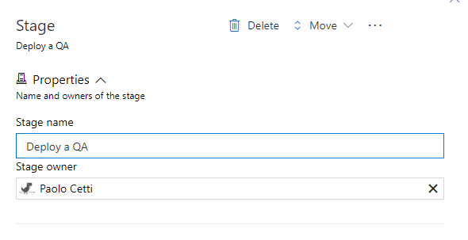
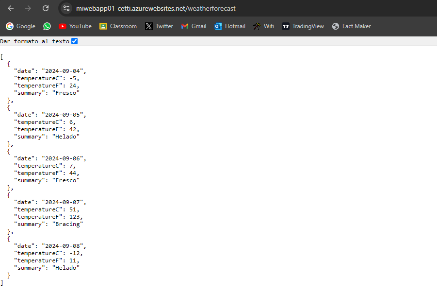
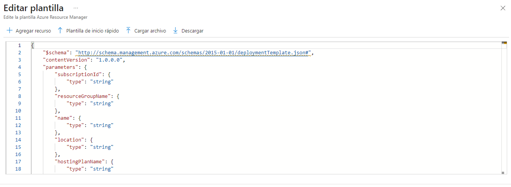
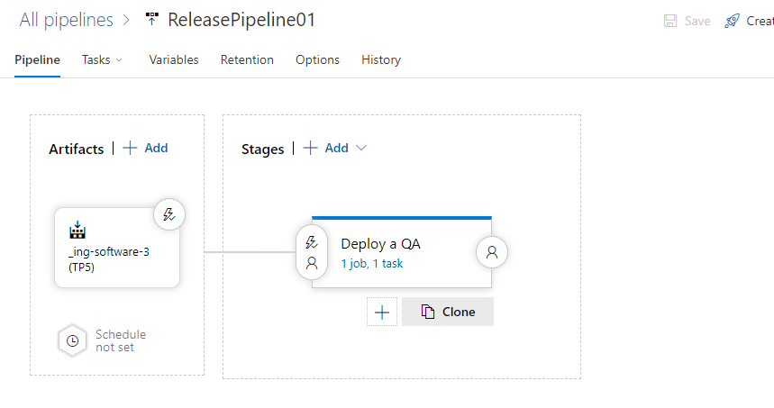
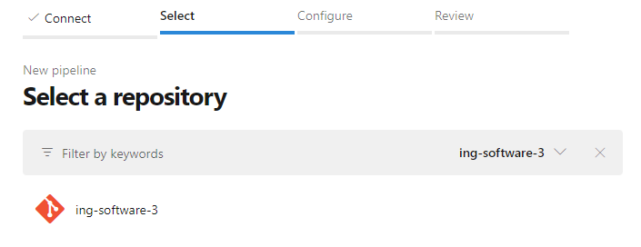

# Trabajo Práctico 5 - Despliegue de aplicaciones con Azure Devops Release Pipelines

### Cetti Paolo (2223989)

# Desarrollo:
4.1\. Crear una cuenta en Azure


4.2\. Crear un recurso Web App en Azure Portal y navegar a la url provista


Creamos un nuevo grupo de recursos


Ponemos el nombre, la pila de entorno y la region


Creamos el plan MiAppPlan01y utilizamos el plan de precios gratis


Pasamos el apartado de base de datos, mantenemos deshabilidata la CI


Habilitamos la autenticacion basica y pasamos a redes


Pasamos a supervision y proteccion, y deshabilitamos Application Insights


Pasamos a Revisar y crear y descargamos la plantilla


Tras arreglar un error de region (no tenia disponible East US con el plan gratuito, cambie a Brazil South).
Se completo Exitosamente la implementacion


Comprobamos su funcionamiento en https://miwebapp01-cetti.azurewebsites.net/


4.3\. Actualizar Pipeline de Build para que use tareas de DotNetCoreCLI@2 como en el pipeline clásico, luego crear un Pipeline de Release en Azure DevOps con CD habilitada

Creamos un nuevo pipeline con el .yaml mandado por whatsapp


Vemos que corrio exitosamente


Creamos un pipeline de realases


Utilizamos el template Azure App Service Deployment


Cambiamos el nombre de la etapa a "Deploy a QA"



Seleccionamos como artifact el build del pipeline creado con el .yaml nuevo


Habilitamos el CI


Configuramos las tareas del stage, elegimos nuestra azure subscription y la autorizamos


Seleccionamos nuestra web app creada en azure portal


Le cambiamos el nombre a ReleasePipeline01


4.4\. Optimizar Pipeline de Build

El pipeline del build ya esta optimizado segun el .yaml que nos paso el profe

4.5\. Verificar el deploy en la url de la WebApp /weatherforecast

Creamos una release para probar 


Fue exitoso



4.6\. Realizar un cambio al código del controlador para que devuelva 7 pronósticos, realizar commit, evaluar ejecución de pipelines de build y release, navegar a la url de la webapp/weatherforecast y corroborar cambio

Realizamos el cambio para que devuelva 7 pronosticos


Hacemos commit


Se ejecuto automatica y exitosamente el pipeline de build


Se ejecuto automatica y correctamente el pipeline de release


Corroboramos que ahora muestra 7 pronosticos


4.7\. Clonar la Web App de QA para que contar con una WebApp de PROD a partir de un Template Deployment en Azure Portal y navegar a la url provista para la WebApp de PROD.

Vamos a crear a partir de template deployment


Creamos nuestra propia plantilla


Tocamos en cargar archivo y cargamos el template.json descargado previamente


Cargamos tambien los parametros y le cambiamos el nombre agregandole PROD


Pasamos a Revisar y Crear, y creamos


Se implemento exitosamente


Corroboramos


Mi grupo de recursos quedo


4.8\. Agregar una etapa de Deploy a Prod en Azure Release Pipelines 

Vamos a editar el ReleasePipeline01 y clonamos el Deploy a QA



Le cambiamos el nombre a Deploy a Prod


Le cambiamos el app service


Seleccionamos Deploy Azure App service y guardamos


4.9\.  Realizar un cambio al código del controlador para que devuelva 10 pronósticos, realizar commit, evaluar ejecución de pipelines de build y release, navegar a la url de la webapp/weatherforecast y corroborar cambio, verificar que en la url de la webapp_prod/weatherforecast se muestra lo mismo.

Realizamos el cambio


El build pipeline se ejecuto correctamente


El release pipeline tambien se ejecuto correctamente


Vemos que tanto en QA como el Release se muestran los 10 pronosticos


4.10\. Modificar pipeline de release para colocar una aprobación manual para el paso a Producción.

Volvemos a editar el release pipeline y habilitamos el pre-deployment approvals con mi usuario


Guardamos esta configuracion

4.11\. Realizar un cambio al código del controlador para que devuelva 5 pronósticos, realizar commit, evaluar ejecución de pipelines de build y release, navegar a la url de la webapp/weatherforecast y corroborar cambio, verificar que en la url de la webapp_prod/weatherforecast aun se muestra la versión anterior.

Realizamos el cambio y commiteamos


Se ejecuto correctamente el pipeline de build


Se ejecuto correctamente el pipeline de release en QA y esta esperando aprobacion


Notamos que en QA muestra 5 pronosticos pero en Prod sigue mostrando los 10


4.12\. Aprobar el pase ya sea desde el release o desde el mail recibido. 

Verificamos el mail


Aprobamos el release


Vemos que en este Release4 se hizo el deploy a Prod


4.12.1\. Notar que se puede dar la aprobación pero posponer su aplicación hasta una determinada fecha


4.13\. Esperar a la finalización de la etapa de Pase a Prod y luego corroborar que en la url de la webapp_prod/weatherforecast se muestra la nueva versión coinicidente con la de QA.

Corroboramos que ahora en prod muestra 5 pronosticos


4.14\. Realizar un pipeline (no release) que incluya el deploy a QA y a PROD con una aprobación manual. El pipeline debe estar construido en YAML sin utilizar el editor clásico de pipelines ni el editor clásico de pipelines de release.
 
Vamos a Pipelines y creamos uno nuevo, no usamos el clasico




Usamos el siguiente .yaml con los stages (pongo el .yaml completo al final del md)


Usamos un Enviroment para poder modificar los usuarios que pueden dar permiso sin modificar el codigo


Ponemos ese enviroment en el stage de deploy a produccion

Lo guardamos y corremos, nos pide permisos. Le damos los permisos a nuestra subscripcion


Vemos como hace el build y deploy en produccion en el stage1 y espera aprobacion para hacer deploy en produccion en el stage2


Le damos la aprobacion


Se ejecuto correctamente y se hicieron los deploys


### El .yaml que use para el 4.14
```yaml 
trigger:
- main

pool:
  vmImage: 'ubuntu-latest'

variables:
  solution: 'SimpleWebAPI.sln'
  buildPlatform: 'Any CPU'
  buildConfiguration: 'Release'
  ConnectedServiceName: 'Azure subscription 1 (de2100ee-d1a0-44f9-90cf-bfd824766f52)' # Subscription ID
  WebAppKind: 'webApp'
  DevWebAppName: 'MiWebApp01-cetti' # QA WebApp name
  ProdWebAppName: 'MiWebApp01-cetti-PROD' # Production WebApp name

stages:
- stage: Build
  displayName: 'Build Application'
  jobs:
  - job: Build
    displayName: 'Build Application'
    steps:
      - task: UseDotNet@2
        inputs:
          packageType: sdk
          version: '8.x'  # Use the correct version of .NET
          installationPath: $(Agent.ToolsDirectory)/dotnet

      - script: |
          echo "Current directory: $(Build.SourcesDirectory)"
          cd $(Build.SourcesDirectory)
          ls -l
          dotnet restore $(solution)
        displayName: 'Restore NuGet Packages'

      - script: |
          dotnet build $(solution) --configuration $(buildConfiguration)
        displayName: 'Build Project'

      - script: |
          dotnet test $(solution) --configuration $(buildConfiguration)
        displayName: 'Run Unit Tests'

      - script: |
          dotnet publish $(solution) --configuration $(buildConfiguration) --output $(Build.ArtifactStagingDirectory) --no-build
        displayName: 'Publish Project'
      
      - task: PublishBuildArtifacts@1
        inputs:
          pathToPublish: '$(Build.ArtifactStagingDirectory)'
          artifactName: 'drop'
          publishLocation: 'Container'
        displayName: 'Publish Build Artifacts'

- stage: DeployToQA
  displayName: 'Deploy to QA'
  dependsOn: Build
  condition: succeeded()
  jobs:
  - job: DeployToQA
    displayName: 'Deploy to QA'
    steps:
      - task: DownloadPipelineArtifact@2
        displayName: 'Download Build Artifacts'
        inputs:
          buildType: 'current'
          artifactName: 'drop'
          targetPath: '$(Pipeline.Workspace)/drop'

      - script: ls -l "$(Pipeline.Workspace)/drop"
        displayName: 'List Pipeline Workspace Content (QA)'

      - task: AzureRmWebAppDeployment@4
        displayName: 'Deploy to Azure App Service (QA)'
        inputs:
          azureSubscription: '$(ConnectedServiceName)'
          appType: 'webApp'
          WebAppName: '$(DevWebAppName)'
          package: '$(Pipeline.Workspace)/drop'

- stage: DeployToProd
  displayName: 'Deploy to Production'
  dependsOn: DeployToQA
  condition: succeeded()
  jobs:
  - deployment: DeployToProd
    displayName: 'Deploy to Production'
    environment: 'Production'
    strategy:
      runOnce:
        deploy:
          steps:
            - task: DownloadPipelineArtifact@2
              displayName: 'Download Build Artifacts'
              inputs:
                buildType: 'current'
                artifactName: 'drop'
                targetPath: '$(Pipeline.Workspace)/drop'

            - script: ls -l "$(Pipeline.Workspace)/drop"
              displayName: 'List Pipeline Workspace Content (Production)'

            - task: AzureRmWebAppDeployment@4
              displayName: 'Deploy to Azure App Service (Production)'
              inputs:
                azureSubscription: '$(ConnectedServiceName)'
                appType: 'webApp'
                WebAppName: '$(ProdWebAppName)'
                package: '$(Pipeline.Workspace)/drop'


``` 