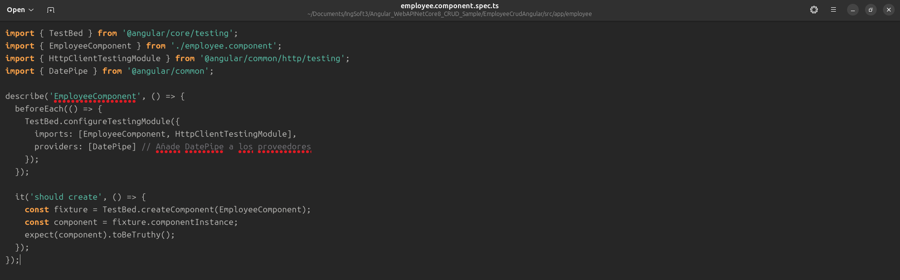
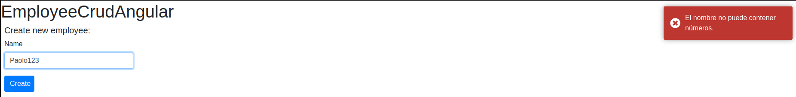
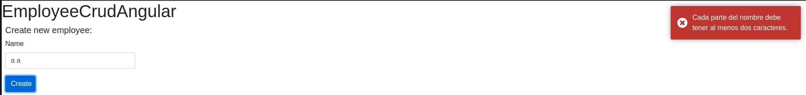

## Trabajo Práctico 6 - Pruebas Unitarias

Cetti Paolo (2223989)

### 4- Desarrollo:
#### Prerequisitos:
Instalamos Node y npm en las versiones solicitadas


Instalamos AngularCLI


Y dotnet8


#### 4.1 Creación de una BD SQL Server para nuestra App
A. Crear una BD Azure SQL Database (Ver Instructivo 5.1) o montar una imagen Docker de SQL Server como se solicitó en el punto 12 del [TP02]. (https://github.com/ingsoft3ucc/TPS_2024/blob/main/trabajos/02-introduccion-docker.md)

Uso mi contenedor de docker


B. En caso de optar por la opción de montar la imagen de docker, una vez levantada el contenedor, conectarse y ejecutar el siguiente script:

Ejecutamos el script (cambie GO por ";")


#### 4.2 Obtener nuestra App
A. Clonar el repo https://github.com/ingsoft3ucc/Angular_WebAPINetCore8_CRUD_Sample.git


B. Seguir las instrucciones del README.md del repo clonado prestando atención a la modificación de la cadena de conexión en el appSettings.json para que apunte a la BD creada en 4.1

Le cambiamos la cadena de conexion para que apunte a nuestra db


Construimos la api y verificamos que funcione


Construimos el CRUD angular y verificamos que funcione


C. Navegar a http://localhost:7150/swagger/index.html y probar uno de los controladores para verificar el correcto funcionamiento de la API.

Funciona correctamente, me trae los empleados


D. Navegar a http://localhost:4200 y verificar el correcto funcionamiento de nuestro front-end Angular


E. Una vez verificado el correcto funcionamiento de la Aplicación procederemos a crear un proyecto de pruebas unitarias para nuestra API.

#### 4.3 Crear Pruebas Unitarias para nuestra API
A. En el directorio raiz de nuestro repo crear un nuevo proyecto de pruebas unitarias para nuestra API


Instalamos las dependencias

```bash
cd EmployeeCrudApi.Tests 
dotnet add package Moq
dotnet add package xunit
dotnet add package Microsoft.EntityFrameworkCore.InMemory
```

C. Editar archivo UnitTest1.cs reemplazando su contenido por


D. Renombrar archivo UnitTest1.cs por EmployeeControllerUnitTests.cs


E. Editar el archivo EmployeeCrudApi.Tests/EmployeeCrudApi.Tests.csproj para agregar una referencia a nuestro proyecto de EmployeeCrudApi reemplazando su contenido por


F. Ejecutar los siguientes comandos para ejecutar nuestras pruebas
G. Verificar que se hayan ejecutado correctamente las pruebas

Se ejecutaron correctamente:


H. Verificar que no estamos usando una dependencia externa como la base de datos.

I. Modificar la cadena de conexión en el archivo appsettings.json para que use un usuario o password incorrecto y recompilar el proyecto EmployeeCrudApi


J. Verificar que nuestro proyecto ya no tiene acceso a la BD navegando a http://localhost:7150/swagger/index.html y probando uno de los controladores:


K. En la carpeta de nuestro proyecto EmployeeCrudApi.Tests volver a correr las pruebas
L. Verificar que se hayan ejecutado correctamente las pruebas inclusive sin tener acceso a la BD, lo que confirma que es efectivamente un conjunto de pruebas unitarias que no requieren de una dependencia externa para funcionar.


M. Modificar la cadena de conexión en el archivo appsettings.json para que use el usuario y password correcto y recompilar el proyecto EmployeeCrudApi


N. Verificar que nuestro proyecto vuelve a tener acceso a la BD navegando a http://localhost:7150/swagger/index.html y probando uno de los controladores:


#### 4.4 Creamos pruebas unitarias para nuestro front de Angular:

A. Nos posicionamos en nuestro proyecto de front, en el directorio EmployeeCrudAngular/src/app


B. Editamos el archivo app.component.spec.ts reemplazando su contenido por:


C. Creamos el archivo employee.service.spec.ts reemplazando su contenido por:


D. Editamos el archivo employee.component.spec.ts ubicado en la carpeta employee reemplazando su contenido por:



E. Editamos el archivo addemployee.component.spec.ts ubicado en la carpeta addemployee reemplazando su contenido por:


F. En el directorio raiz de nuestro proyecto EmployeeCrudAngular ejecutamos el comando
ng test

G. Vemos que se abre una ventana de Karma con Jasmine en la que nos indica que los tests se ejecutaron correctamente


H. Vemos que los tests se ejecutaron correctamente:


I. Verificamos que no esté corriendo nuestra API navegando a http://localhost:7150/swagger/index.html y recibiendo esta salida:


J. Los puntos G y H nos indican que se han ejecutado correctamente las pruebas inclusive sin tener acceso a la API, lo que confirma que es efectivamente un conjunto de pruebas unitarias que no requieres de una dependencia externa para funcionar.

#### 4.5 Agregamos generación de reporte XML de nuestras pruebas de front.
Para cuando integremos nuestras pruebas en un pipeline de Build, vamos a necesitar el resultado devuelto por nuestras pruebas para reportarlas junto a las pruebas de back que se reportan automaticamente.

A. Instalamos dependencia karma-junit-reporter


B. En el directorio raiz de nuestro proyecto (al mismo nivel que el archivo angular.json) creamos un archivo karma.conf.js con el siguiente contenido


C. Ejecutamos nuestros test de la siguiente manera:


D. Verificamos que se creo un archivo test-result.xml en el directorio test-results que está al mismo nivel que el directorio src


#### 4.6 Modificamos el código de nuestra API y creamos nuevas pruebas unitarias:

A. Realizar al menos 5 de las siguientes modificaciones sugeridas al código de la API:

* La longitud máxima del nombre y apellido del empleado debe ser de 100 caracteres.
* Validar que el nombre tenga un número mínimo de caracteres, por ejemplo, al menos dos caracteres para evitar entradas inválidas como "A".
* Verificar que el nombre no contenga números, ya que no es común en los nombres de empleados.
* Verificar que no haya palabras vacías o que el nombre no esté compuesto solo de espacios.
* Asegurar que cada parte del nombre (separada por espacios) tenga al menos un carácter o más, por ejemplo, para evitar "A B".

En todos los casos donde no se cumplan las condiciones, la API debe devolver un error de HTTP 400 Bad Request y un Json indicando el error, por ejemplo:
{
  "status": 400,
  "error": "Bad Request",
  "message": "El nombre del empleado ya existe."
}


B. Crear las pruebas unitarias necesarias para validar las modificaciones realizadas en el código

Creamos las pruebas para cada uno de los 5 escenarios


Buildeamos los test y los corremos


#### 4.7 Modificamos el código de nuestro Front y creamos nuevas pruebas unitarias:

A. Realizar en el código del front las mismas modificaciones hechas a la API.
B. Las validaciones deben ser realizadas en el front sin llegar a la API, y deben ser mostradas en un toast como por ejemplo https://stackblitz.com/edit/angular12-toastr?file=src%2Fapp%2Fapp.component.ts o https://stackblitz.com/edit/angular-error-toast?file=src%2Fapp%2Fcore%2Frxjsops.ts

Instalamos la libreria de toast


Abrimos el archivo src/app/app.config.ts y agregamos las importaciones necesarias para ToastrModule y BrowserAnimationsModule.


Tambien importamos el css con los estilos de los toast


Agregamos las validaciones en AddEmployee y las probamos







C. Crear las pruebas unitarias necesarias en el front para validar las modificaciones realizadas en el código del front.

Creamos las pruebas unitarias en addemployee.component.spec


Las ejecutamos exitosamente


### 6. Subir el proyecto

Link a repo: https://github.com/cettipao/AngularCrud-UnitTests