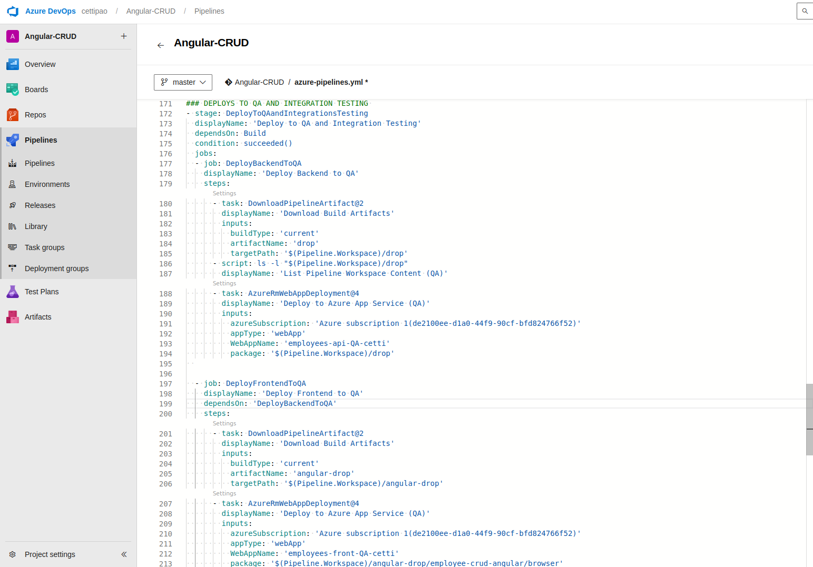

## Trabajo Práctico 7 - Code Coverage, Análisis estático de Código y Pruebas de Integración

CETTI Paolo (2223989)

Proyecto de Azure DevOps: https://dev.azure.com/cettipao/Angular-CRUD

#### 4.1 Agregar Code Coverage a nuestras pruebas unitarias de backend y front-end e integrarlas junto con sus resultados en nuestro pipeline de build.
- Desarrollo del punto 4.1: 
	- ##### 4.1.1 En el directorio raiz de nuestro proyecto Angular instalar el siguiente paquete:

 - ##### 4.1.2 Editar nuestro archivo karma.conf.js para que incluya reporte de cobertura

 

 - ##### 4.1.3 En el dir raiz del proyecto EmployeeCrudApi.Tests ejecutar:

 

 - ##### 4.1.4 Agregar a nuestro pipeline ANTES del Build de Back la tarea de test con los argumentos especificados y la de publicación de resultados de cobertura:

 - ##### 4.1.5 Agregar a nuestro pipeline ANTES del Build de front la tarea de test y la de publicación de los resultados.

 - ##### 4.1.6 Ejecutar el pipeline y analizar el resultado de las pruebas unitarias y la cobertura de código.

 

 

#### 4.2 Agregar Análisis Estático de Código con SonarCloud:

##### 4.2.1 Integraremos SonarCloud para analizar el código fuente. Configurar SonarCloud en nuestro pipeline siguiendo instructivo 5.1

* Antes de nuestra tarea de Build del Back:

* Despues de nuestra tarea de Build del Back:

##### 4.2.2 Vemos el resultado de nuestro pipeline, en extensions tenemos un link al análisis realizado por SonarCloud

##### 4.2.3 Ir al link y analizar toda la información obtenida. Detallar en la entrega del TP los puntos más relevantes del informe, qué significan y para qué sirven.

### Análisis de SonarCloud

- **Total de issues:** 7 (47 min de esfuerzo)
- **Categorías:** Code Smells (Mantenibilidad, Fiabilidad) y Vulnerabilidad de Seguridad.

#### Puntos relevantes:

1. **Vulnerabilidad de Seguridad (Blocker):**  
   Contraseña expuesta en `appsettings.json`.  
   **Solución:** Cambiar y eliminar la contraseña del código.
   Esto me indica que la password a la db se ve expuesta en el archivo appsetting.json, lo cual es peligroso para hackeos

2. **Code Smells:**  
   - **_context no es readonly** en `EmployeeController.cs`.  
   **Solución:** Declarar `_context` como `readonly`.
   context deberia ser readonly
   - **Propiedades de valor deben ser anulables o requeridas** en `Employee.cs`.  
   **Solución:** Usar `nullable` o `JsonRequired`.
   - **Await en RunAsync** en `Program.cs`.  
   **Solución:** Añadir `await` para asegurar correcta ejecución asíncrona.

#### Esfuerzo total: 47 min (30 min para la vulnerabilidad).
Me indica un estimado de cuanto tiempo tardare en corregir estos puntos

#### 4.3 Pruebas de Integración con Cypress:

##### 4.3.1 En el directorio raiz de nuestro proyecto Angular instalar el siguiente paquete:

##### 4.3.2 Abrir Cypress:

##### 4.3.3 Inicializar Cypress en nuestro proyecto como se indica en el instructivo 5.2

Seguimos los pasos del instructivo 5.2

Esto creará automáticamente una estructura de carpetas dentro de tu proyecto.

##### 4.3.4 Crear nuestra primera prueba navegando a nuestro front.

En la carpeta cypress/e2e, crear un archivo con el nombre primer_test.js y agregar el siguiente código para probar la página de inicio de nuestro front:

4.3.5 Correr nuestra primera prueba

Ejecutamos la prueba en cypress:

También es posible ejecutar Cypress en modo "headless" (sin interfaz gráfica) utilizando el siguiente comando:

##### 4.3.6 Modificar nuestra prueba para que falle.
* Editamos el archivo primer_test.cy.js y hacemos que espere otra cosa en el título

* Ejecutamos cypress en modo headless

Ejecutamos y verificamos que dio error

Observamos el screenshot que saco

##### 4.3.6 Grabar nuestras pruebas para que Cypress genere código automático y genere reportes:
* Cerramos Cypress
* Editamos el archivo cypress.config.ts incluyendo la propiedad experimentalStudio en true y la configuración de reportería.

* Corremos nuevamente Cypress con npx cypress open, una vez que se ejecute nuestra prueba tendremos la opción de "Add Commands to Test". Esto permitirá interactuar con la aplicación y generar automáticamente comandos de prueba basados en las interacciones con la página:

Por ejemplo, si agregamos un nuevo empleado y luego verificamos que esté en la lista, Cypress nos generará un código como este:

Por supuesto que habrá que hacerle ajustes, como por ejemplo que se fije siempre en la última fila de la grilla y no en la posición 15 como lo grabó, es ahí cuando consultando la documentación de Cypress debemos ver cómo modificar el código, en nuestro caso de ejemplo sería así:

##### 4.3.7 Hacemos prueba de editar un empleado
* Creamos en cypress/e2e/ un archivo editEmployee_test.cy.js con el siguiente contenido, guardamos y aparecerá en Cypress:

- Hacemos "Add command to the test" y empezamos a interactuar con la página

Hacemos algunos ajustes al código generado:

Observamos que se ejecuta correctamente

#### 4.4 Desafíos:
Integrar en el pipeline SonarCloud para nuestro proyecto Angular, mostrar el resultado obtenido en SonarCloud

Para ello previo al build del frontend preparamos el SonarCloud

Post-build, publicamos los resultados de sonarcloud

Implementar en Cypress pruebas de integración que incluya los casos desarrollados como pruebas unitarias del front en el TP06.

Entramos a Cypress Studio y programamos las 5 pruebas unitarias

Realizamos los cambios necesarios en codigo para que funcionen, nos quedan estas 5 pruebas:

Incorporar al pipeline de Deploy la ejecución de las pruebas de integración y la visualización de sus resultados.

Para ello, creamos 2 Web Apps nuevas en Azure para hacerles el deploy

Una con .Net 8 y otra con Node

Para el correcto funcionamiento de la app, necesitaremos una base de datos. Yo voy a usar el SqlServer que tengo en docker exponiendo el puerto a internet

La DB en docker

Exponemos el puerto de mi pc en la pagina de configuracion de mi router

Cambiamos la cadena de conexion de la api para que apunte a mi db

Nos aseguramos que en los test de cypress entre a la pagina deployada de QA

Creamos un nuevo stage de Deploy y Integration testing con los siguientes jobs

Deploy de Backend y Frontend

Integrations Testings

Resultado esperado:

* Un Pipeline en YAML que incluya a) Build de QA y Front con ejecución y resultado de pruebas de code coverage, pruebas unitarias y análisis de Sonar Cloud y b) Deploy a WebApp(s) de QA y Front que incluya ejecución y resultado de pruebas de integración

* Dos Stages: Una para Build, Test Unitarios, Code Coverage y SonarCloud y otra para el Deploy a QA con Tests de Integración

* En la pestaña Test, poder visualizar los Test Unitarios de Front y Back y los Test de Integracion:

* En la pestaña Code Coverage, visualizar la cobertura de las pruebas unitarias de Back y de Front:

* En la pestaña Extensions, ver el análisis de SonarCloud en verde

* Un documento de una carilla explicando qué información pudieron sacar del análisis de Sonar Cloud y de las pruebas de cobertura.

## Informe de Análisis de SonarCloud y Cobertura de Código

### Cobertura de Código

El análisis de cobertura de código revela que el sistema tiene una cobertura general del **61.64%**. Esta cifra indica que aproximadamente dos tercios del código base están cubiertos por pruebas unitarias, mientras que el restante 38.36% carece de cobertura, lo que puede implicar riesgos en áreas no probadas. Se destaca lo siguiente:

- **EmployeeController.cs** tiene una alta cobertura del **95.56%**, lo que sugiere que gran parte de la lógica del controlador está siendo probada adecuadamente.
- **ApplicationDbContext.cs** y **Employee.cs** cuentan con una cobertura del **100%**, lo cual asegura que las pruebas incluyen todos los métodos y propiedades importantes en estos componentes.
- **Program.cs** tiene una cobertura nula (**0%**), lo que significa que no se han implementado pruebas para el archivo de configuración principal de la aplicación. Esto podría ser un área crítica que necesita atención.
- En el frontend, **addemployee.component.ts** tiene un nivel de cobertura aceptable del **69.05%**, pero otras áreas, como **employee.component.ts**, solo cubren el **22.73%**, lo que deja una brecha significativa en la cobertura.

### Hallazgos de SonarCloud

SonarCloud detectó varias vulnerabilidades y problemas de mantenimiento en el código del backend y frontend. Se pueden clasificar en los siguientes tipos:

1. **Seguridad (Vulnerabilidades)**
   - Se detectaron contraseñas de base de datos en archivos de configuración, como en `appsettings.json`. Este es un riesgo **crítico (blocker)** y se recomienda eliminar las credenciales sensibles del código y gestionarlas de forma segura (por ejemplo, utilizando variables de entorno).

2. **Mantenibilidad (Code Smells)**
   - En el frontend, hay un número significativo de "code smells" menores y mayores que incluyen redundancias en importaciones y asignaciones innecesarias, especialmente en archivos como **employee.service.ts**.
   - En el frontend, se encontraron problemas relacionados con código duplicado en estilos CSS y código comentado sin usar en varios archivos, como en **styles.css** y **employee.component.css**.

3. **Accesibilidad**
   - En el frontend, se detectaron varios problemas relacionados con la accesibilidad, como la falta de atributos `alt` en imágenes y etiquetas de formulario sin asociación correcta con controles. Estas fallas impactan negativamente en la accesibilidad web, especialmente para usuarios con discapacidades.

4. **Errores Menores de Fiabilidad**
   - Se identificaron pequeños bugs en la implementación del frontend, como el uso de un `for` loop en lugar de un `for-of` loop y la redundancia en la importación de módulos.

### Conclusiones

El análisis de SonarCloud y la cobertura de código proporcionan una visión clara de los puntos fuertes y débiles del proyecto. La cobertura en líneas generales es aceptable, pero hay áreas críticas que necesitan mayor cobertura de pruebas, como el archivo `Program.cs` (Podria justificarse ya que es el archivo que levanta todos los componentes de la api, no cumple mas función que de configuraciones). Además, la detección de vulnerabilidades graves y problemas de mantenibilidad subraya la necesidad de aplicar prácticas de seguridad adecuadas y refactorización del código para mejorar su legibilidad y eficiencia.

Es recomendable priorizar la eliminación de credenciales sensibles del código y mejorar la cobertura de pruebas en componentes clave para reducir riesgos en el futuro.