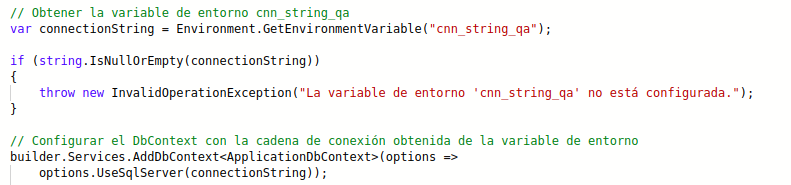
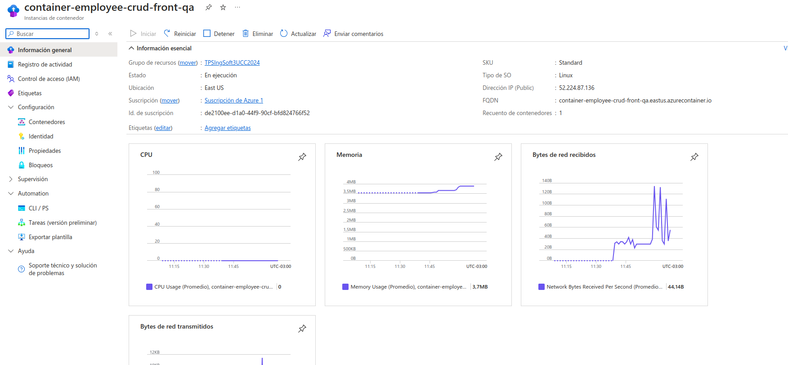
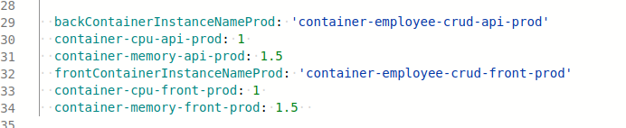
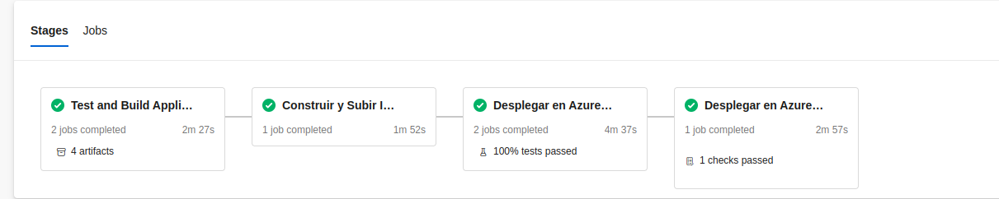

## Trabajo Práctico 8 - Implementación de Contenedores en Azure y Automatización con Azure CLI

### Cetti Paolo (223989)

### 4- Desarrollo:
#### Prerequisitos:
 - Azure CLI instalado 

Instalamos con:

Verificamos la instalacion:

#### 4.1 Modificar nuestro pipeline para construir imágenes Docker de back y front y subirlas a ACR
- Desarrollo del punto 4.1: 
	- ##### 4.1.1 Crear archivos DockerFile para nuestros proyectos de Back y Front
   	  - En la raiz de nuestro repo crear una carpeta docker con dos subcarpetas api y front, dentro de cada una de ellas colocar los dockerfiles correspondientes para la creación de imágenes docker en función de la salida de nuestra etapa de Build y Test
       

		
- ##### 4.1.2 Crear un recurso ACR en Azure Portal siguiendo el instructivo 5.1

Creamos el Container Registry

- ##### 4.1.3 Modificar nuestro pipeline en la etapa de Build y Test
	- Luego de la tarea de publicación de los artefactos de Back agregar la tarea de publicación de nuestro dockerfile de back para que esté disponible en etapas posteriores:

	

	- Luego de la tarea de publicación de los artefactos de Front agregar la tarea de publicación de nuestro dockerfile de front para que esté disponible en etapas posteriores:

	

- ##### 4.1.4 En caso de no contar en nuestro proyecto con una ServiceConnection a Azure Portal para el manejo de recursos, agregar una service connection a Azure Resource Manager como se indica en instructivo 5.2 

Creamos el Azure Resource Manager

- ##### 4.1.5 Agregar a nuestro pipeline variables 

- ##### 4.1.6 Agregar a nuestro pipeline una nueva etapa que dependa de nuestra etapa de Build y Test
	- Agregar tareas para generar img/imagen Docker de Back
	
	

- ##### 4.1.7 - Ejecutar el pipeline y en Azure Portal acceder a la opción Repositorios de nuestro recurso Azure Container Registry. Verificar que exista una img/imagen con el nombre especificado en la variable backimg/imageName asignada en nuestro pipeline

Ejecutamos el pipeline

Verificamos que existe la img/imagen en el portal de azure

- ##### 4.1.8 - Agregar tareas para generar img/imagen Docker de Front (DESAFIO)
	- A la etapa creada en 4.1.6 Agregar tareas para generar img/imagen Docker de Front

Agregamos una variable frontimg/imageName

Realizamos las tareas de construccion de la img/imagen de front y publicacion

Ejecutamos y verificamos que se hayan publicado ambas img/imagenes

- ##### 4.1.9 - Agregar a nuestro pipeline una nueva etapa que dependa de nuestra etapa de Construcción de img/imagenes Docker y subida a ACR
	- Agregar variables a nuestro pipeline:

- Agregar variable secreta cnn-string-qa desde la GUI de ADO que apunte a nuestra BD de SQL Server de QA como se indica en el instructivo 5.3

Tenemos que modificar program.cs para que lea la variable de entorno y use esa cadena de conexion

	
- Agregar tareas para crear un recurso Azure Container Instances que levante un contenedor con nuestra img/imagen de back
	

Para que funcione, hay que habilitar el acceso administrativo de ACR desde azure CLI

Ademas, debemos registrar el proveedor de recursos Microsoft.ContainerInstance, que es necesario para crear instancias de contenedores en Azure.

- ##### 4.1.10 - Ejecutar el pipeline y en Azure Portal acceder al recurso de Azure Container Instances creado. Copiar la url del contenedor y navegarlo desde browser. Verificar que traiga datos.

Ejecutamos el pipeline exitosamente

Vemos que levanto el contenedor

Verificamos que trae datos

- ##### 4.1.11 - Agregar tareas para generar un recurso Azure Container Instances que levante un contenedor con nuestra img/imagen de front (DESAFIO)
- A la etapa creada en 4.1.9 Agregar tareas para generar contenedor en ACI con nuestra img/imagen de Front
	- Tener en cuenta que el contenedor debe recibir como variable de entorno API_URL el valor de una variable container-url-api-qa definida en nuestro pipeline.
	- Para que el punto anterior funcione el código fuente del front debe ser modificado para que la url de la API pueda ser cambiada luego de haber sido construída la img/imagen. Se deja un ejemplo de las modificaciones a realizar en el repo https://github.com/ingsoft3ucc/CrudAngularConEnvironment.git

Creamos la variable de entorno API_URL con la url a nuestro backend

Realizamos los cambios al frontend para que tome la api_url

Agregamos las tareas para que levante el contenedor de front

Para ello necesitaremos agregar las siguientes variables de entorno

Verificamos que el contenedor esta en ejecucion y que el front funciona correctamente

	
- ##### 4.1.12 - Agregar tareas para correr pruebas de integración en el entorno de QA de Back y Front creado en ACI.

Agregamos las tareas de pruebas de integracion con una nueva variable de entorno baseUrl para que el test visite la pagina correspondiente 

Le agregamos a los test que use la variable de entorno baseUrl 

Ejecutamos y verificamos los resultados de los tests

	
#### 4.4 Desafíos:
- 4.4.1 Agregar tareas para generar img/imagen Docker de Front. (Punto 4.1.8)

Listo

- 4.4.2 Agregar tareas para generar en Azure Container Instances un contenedor de img/imagen Docker de Front. (Punto 4.1.11)

Listo

- 4.4.3 Agregar tareas para correr pruebas de integración en el entorno de QA de Back y Front creado en ACI. (Punto 4.1.12)

Listo

- 4.4.4 Agregar etapa que dependa de la etapa de Deploy en ACI QA y genere contenedores en ACI para entorno de PROD.

Agregamos un enviroment production con un pre-check approval para el deployment a prod

Debemos crear 2 variables de entorno mas para que cambie la cadena de conexion a la api y a la db segun sea QA/PROD (en este caso, la db sera la misma en ambos entornos)

Agregamos el stage y las tareas de publicacion a prod con ACI

Con las siguientes variables

Al ejecutar, vemos que nos pide aprobacion para deploy en prod

Vemos que lo ejecuto exitosamente y corroboramos en azure y en el link generado que todo funcione

