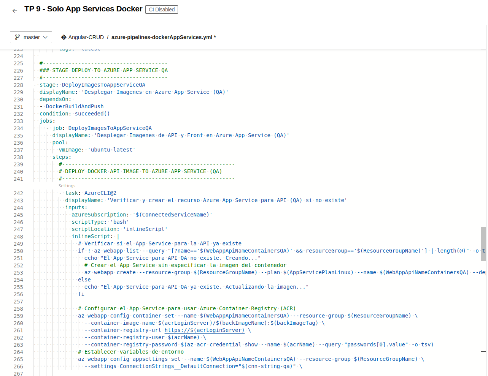
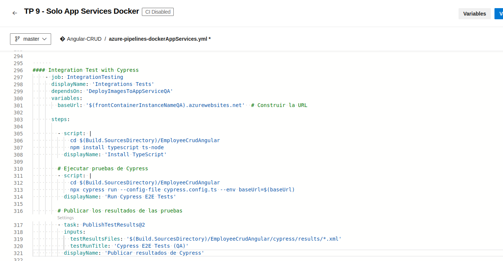

## Trabajo Práctico 9 - Implementación de Contenedores en Azure Parte 2

### Paolo Cetti (2223989)

### 4- Desarrollo:

#### 4.1 Modificar nuestro pipeline para incluir el deploy en QA y PROD de Imagenes Docker en Servicio Azure App Services con Soporte para Contenedores
- Desarrollo del punto 4.1: 
	
##### 4.1.1 - Agregar a nuestro pipeline una nueva etapa que dependa de nuestra etapa de Construcción y Pruebas y de la etapa de Construcción de Imagenes Docker y subida a ACR realizada en el TP08
  	    
- Agregar tareas para crear un recurso Azure Container Instances que levante un contenedor con nuestra imagen de back utilizando un AppServicePlan en Linux

Primero creamos el AppServicePlan de Linux en Azure Portal


Creamos las siguientes variables de entorno (ademas de las que usamos para el tp anterior)


Y pegamos el stage de deploy app service despues de geenrar las imagenes en acr



Ejecutamos y vemos que ejecutó correctamente, creó el app service y corre bien


	
  	  ```
  	     
#### 4.2 Desafíos:
- 4.2.1 Agregar tareas para generar Front en Azure App Service con Soporte para Contenedores

Agregamos la siguiente variable de entorno


Modificamos el codigo para que deployee el frontImage en Azure App Service con Soporte para Contenedores


- 4.2.2 Agregar variables necesarias para el funcionamiento de la nueva etapa considerando que debe haber 2 entornos QA y PROD para Back y Front.

Para ello tendremos que tener 4 variables, 2 de ellas secretas


- 4.2.3 Agregar tareas para correr pruebas de integración en el entorno de QA de Back y Front creado en Azure App Services con Soporte para Contenedores. 

Creamos el job de pruebas de integracion asegurandonos que se le pase correctamente el baseUrl segun el tipo de servicio



- 4.2.4 Agregar etapa que dependa de la etapa de Deploy en QA que genere un entorno de PROD.

Creamos las siguientes variables de entorno para los containers de PROD


Creamos el stage con las tareas de deploy a prod


Probamos que este pipeline funcione antes de realizar el 4.2.5

Vemos que lo ejecuta correctamente y pide la aprobacion para pasar a prod


Le damos la aprobacion


Y se ejecuta correctamente


Se generaron los 4 App Services


Abrimos ambos frontend y verificamos que todo funcione


- 4.2.5 Entregar un pipeline que incluya:
  - A) Etapa Construcción y Pruebas Unitarias y Code Coverage Back y Front
  - B) Construcción de Imágenes Docker y subida a ACR
  - C) Deploy Back y Front en QA con pruebas de integración para Azure Web Apps
  - D) Deploy Back y Front en QA con pruebas de integración para ACI
  - E) Deploy Back y Front en QA con pruebas de integración para Azure Web Apps con Soporte para contenedores
  - F) Aprobación manual de QA para los puntos C,D,E
  - G) Deploy Back y Front en PROD para Azure Web Apps
  - H) Deploy Back y Front en PROD para ACI
  - I) Deploy Back y Front en PROD para Azure Web Apps con Soporte para contenedores

El Pipeline se encuentra como "TP9 - Desafio Integrador" en mi proyecto "Angular-CRUD"

Ejecutamos exitosamente y vemos que deploya todo y nos pide permisos para pasar a produccion


Le damos los permisos y vemos que ejecuta todo exitosamente


Vemos que todas las instancias funcionan


             


