### Desafio: Deploy de Back y Front en Container Apps

#### Cetti Paolo (2223989)

Para este desafio, realizare un pipeline de un deploy del proyecto en Container Apps y despues creare otro integrador que incluya todos los deploys

1.1 Creamos un Container apps env

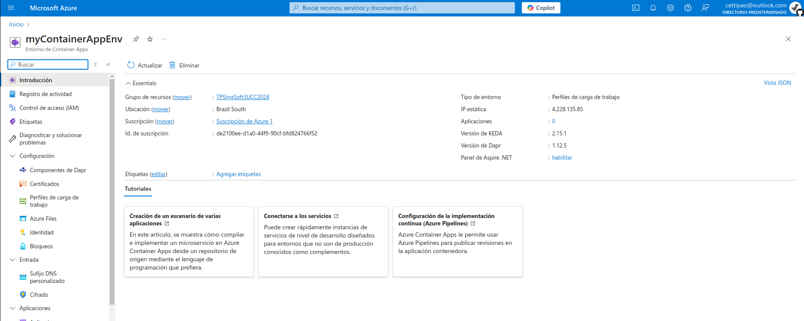

Creamos el Stage que deploya a QA

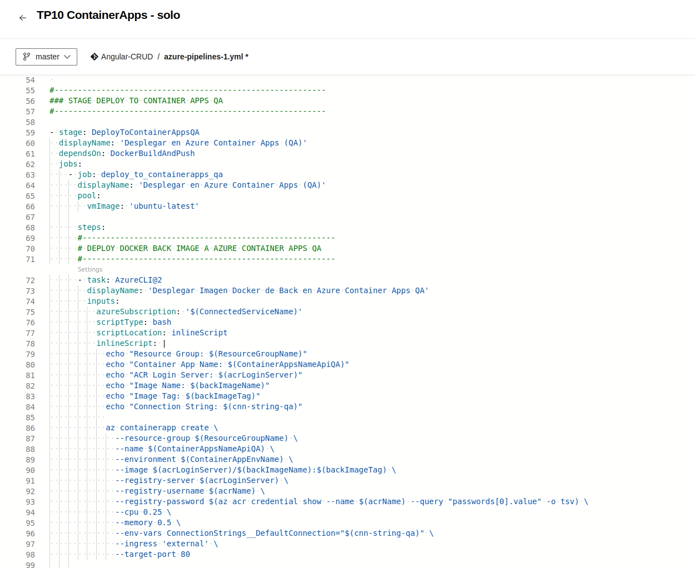

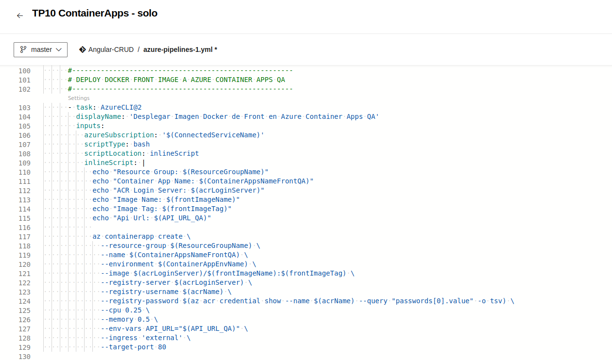

Le agregamos su test de integraicion con la url del front del container app

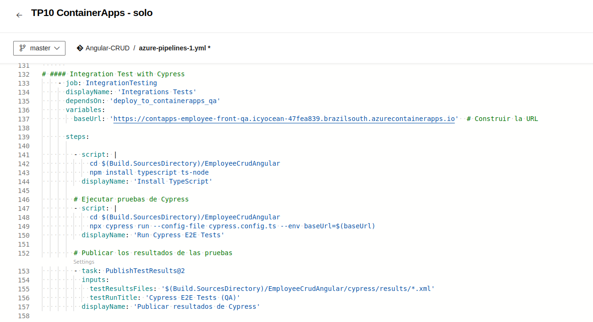

Creamos el Stage de Deploy a Prod (con enviroment para aprobar el deploy)

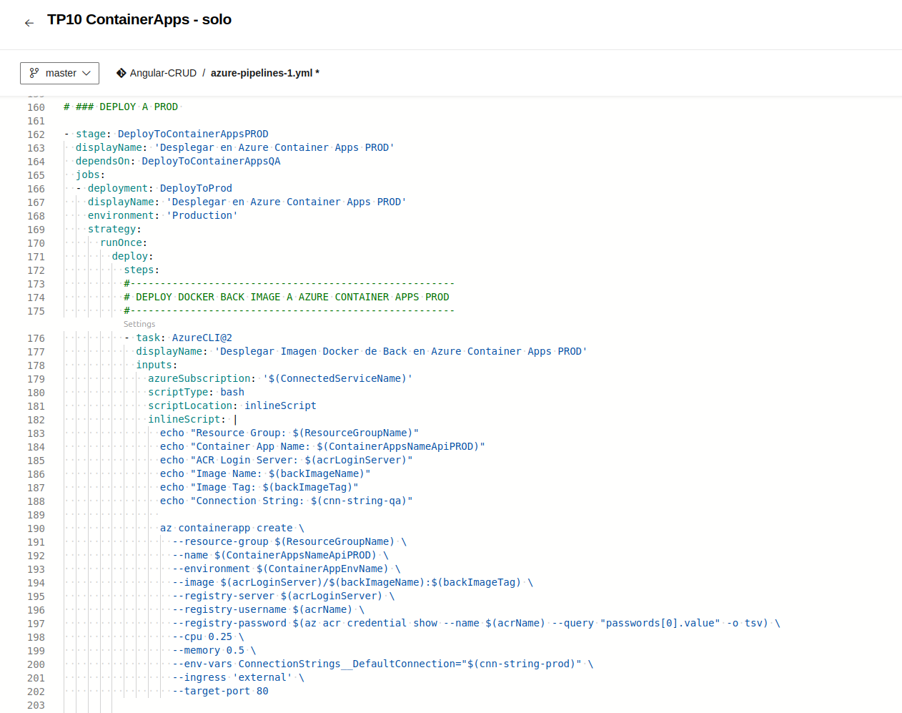

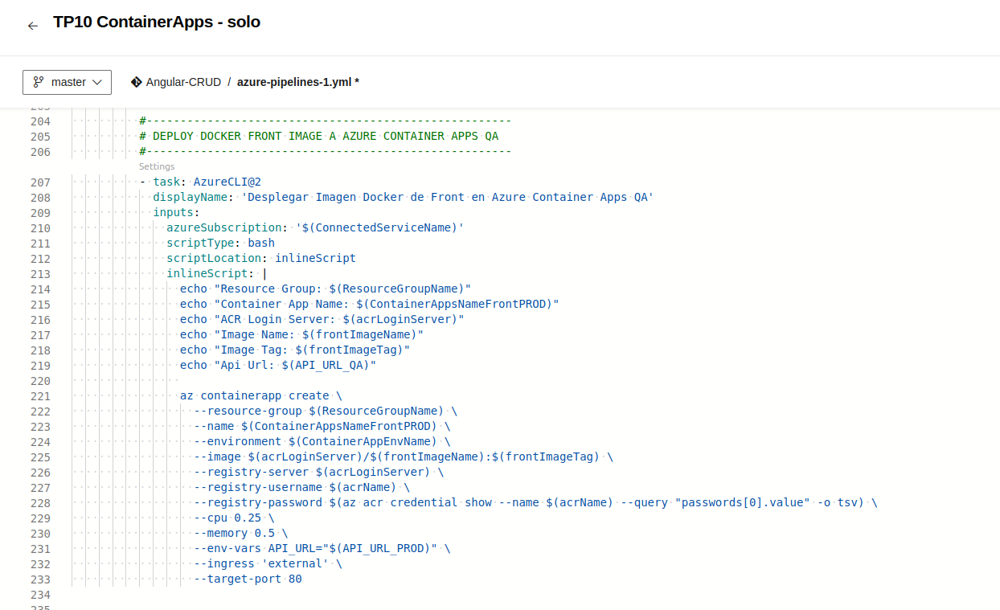

Creamos las variables correspondientes

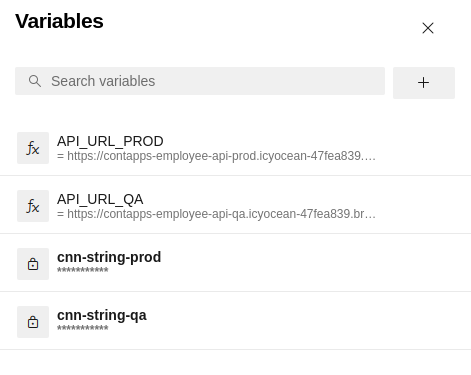

Ejecutamos y vemos que ejecuto exitosamente el despliegue a QA

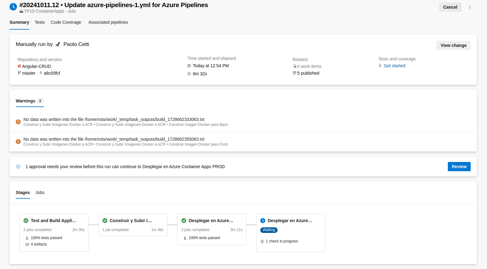

Vemos en el env que se crearon los dos container apps

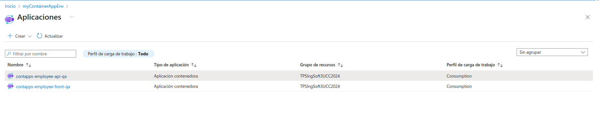

Abrimos el front y vemos que funciona con la api_url bien seteada

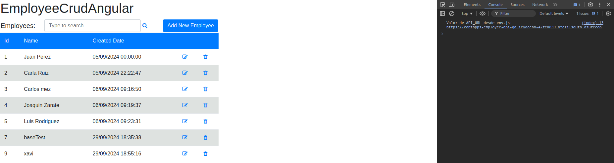

Le damos permisos para deployar a prod

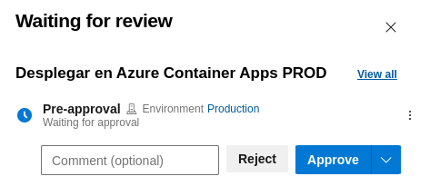

Deploya en prod exitosamente y corroboramos

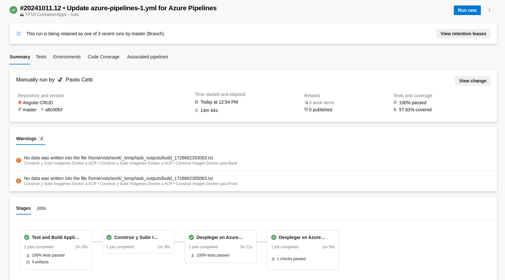

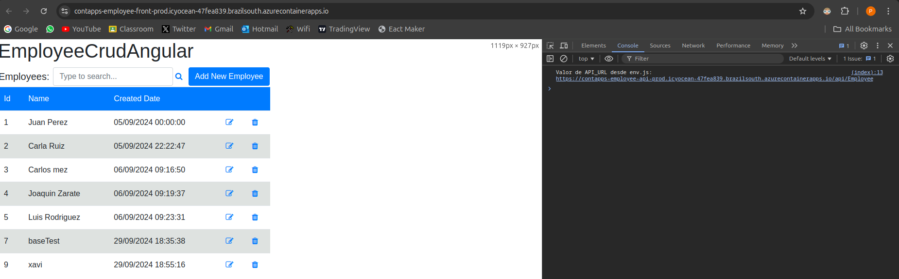

### Desafio Integrador

Ahora vamos a volver a hacer el integrador pero agregandole Container Apps

Para eso, hacemos 2 templates con los stages de deploy recien hechos

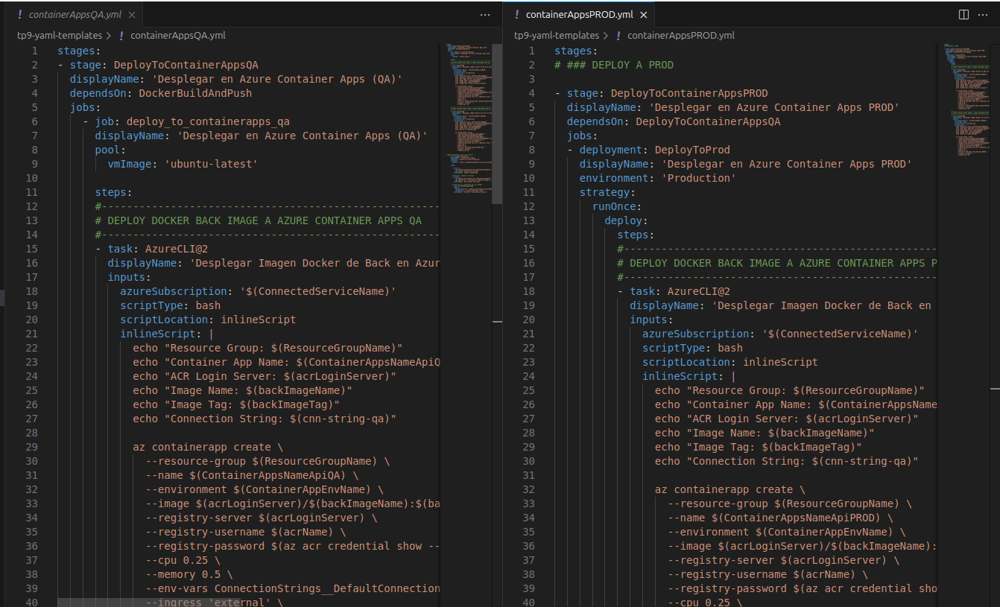

Los agregamos al nuevo tp integrador con todos los templates (No hago el deploy a ACI para que no me sigan cobrando, se hizo en el TP9 igual)

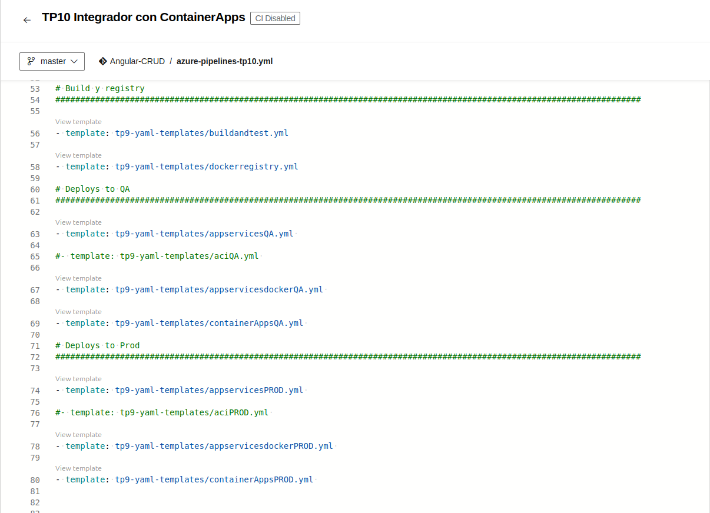

Todas las variables

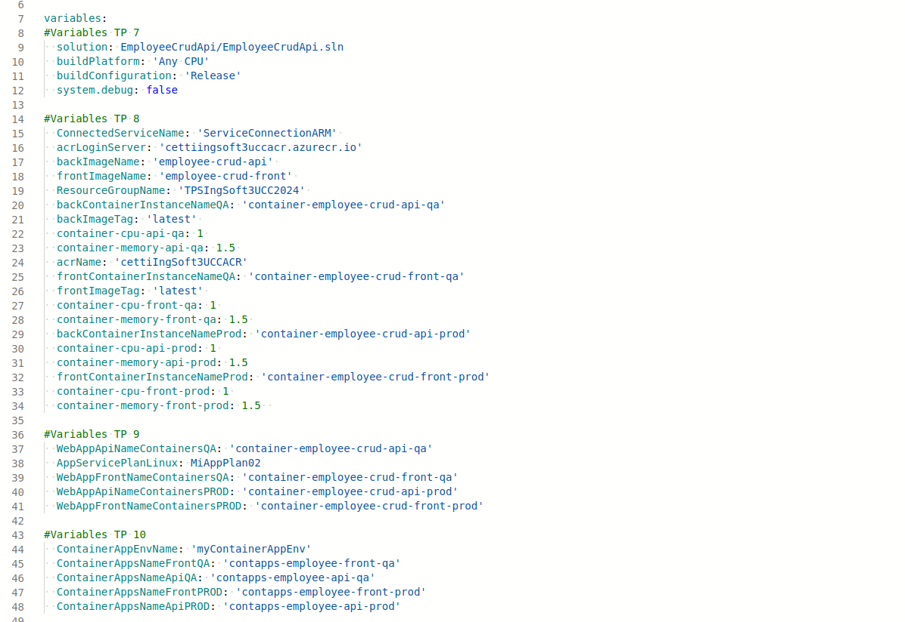

!

Ejecutamos el pipeline correctamente (sin ACI para que no me cobren, ya lo hice en el integrador TP9)

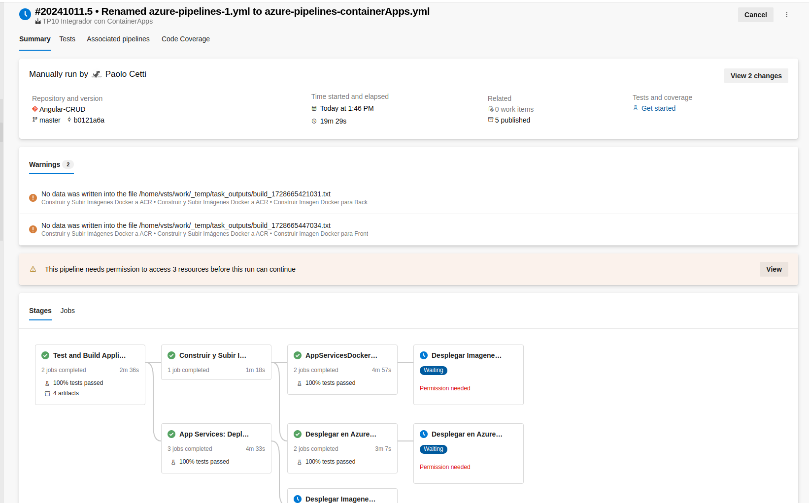

Le damos los permisos para deploy a prod

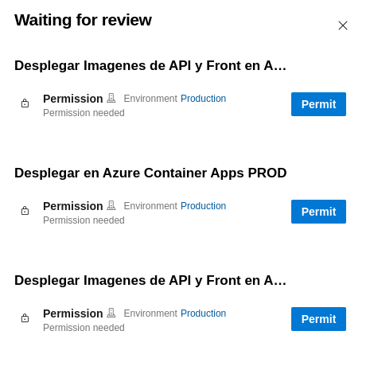

Se ejecuta todo exitosamente

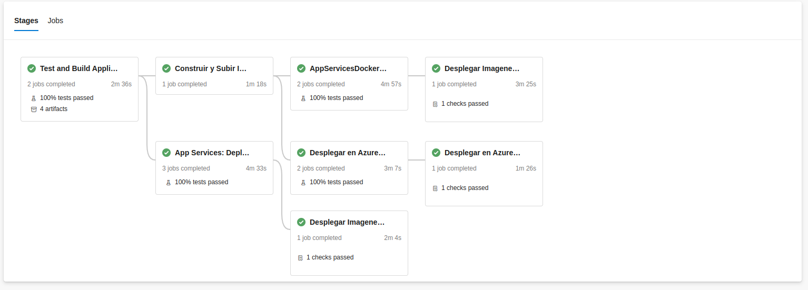

Asi se ve el pipeline con ACI descomentado

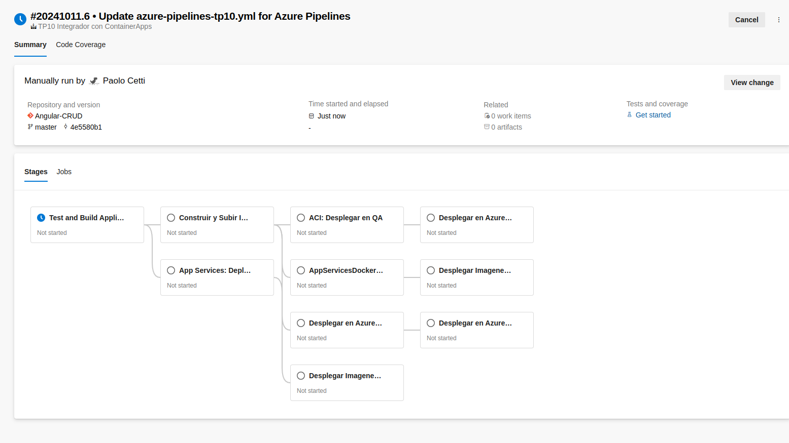
